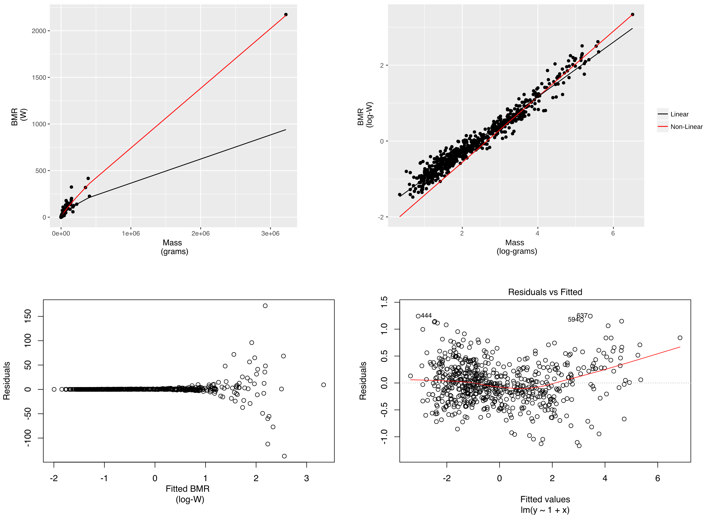

#### The relationship between body mass and metabolic rate ####

This repository contains the R code used for the answer in [Statistical method
for characterizing the relationship between body mass and metabolic rate](https://biology.stackexchange.com/a/66659/36209). The purpose of this exercise was to investigate whether fitting either a linear model to log-transformed data or a non-linear model directly to the un-transformed data is more appropriate, as well as for me to start learning the R language.

The data used were acquired from [Kolokotrones et al. 2010][1] who originally took them from McNab ([2008][2]).
   

The final figure was put together in Inkscape.
   

#### References ####
* Kolokotrones, T., Van Savage, Deeds, E. J., & Fontana, W. (2010). Curvature in metabolic scaling. *Nature*, **464**:7289, 753–756. https://doi.org/10.1038/nature08920
* McNab, B.K. (2008). An analysis of the factors that influence the level and scaling of mammalian BMR. *Comparative Biochemistry and Physiology Part A: Molecular & Integrative Physiology*, **151**:1, 5-28. https://doi.org/10.1016/j.cbpa.2008.05.008.

[1]: https://www.nature.com/nature/journal/v464/n7289/full/nature08920.html
[2]: http://www.sciencedirect.com/science/article/pii/S1095643308007782
